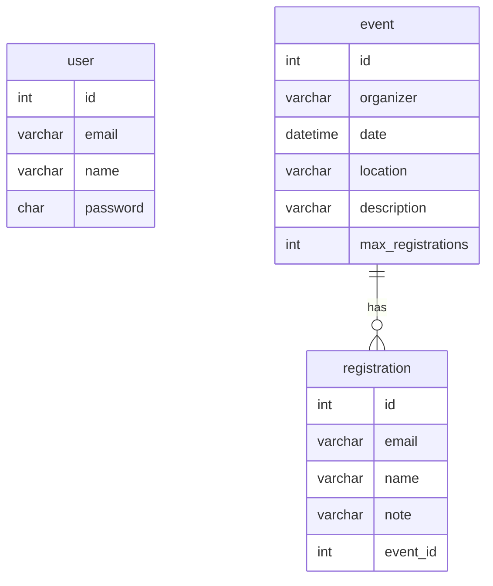

## Party planner requirements

# Views

-   Index -> List of upcoming events.
-   Event CRUD
-   Login
-   Admin panel

# Database

-   User
-   Event
-   Registration

```mermaid
erDiagram
    user {
        int id
        varchar email
        varchar name
        char password
    }
    event {
        int id
        varchar organizer
        datetime date
        varchar location
        varchar description
        int max_registrations
    }
    registration {
        int id
        varchar email
        varchar name
        varchar note
        int event_id
    }
    event ||--o{ registration : has
```
